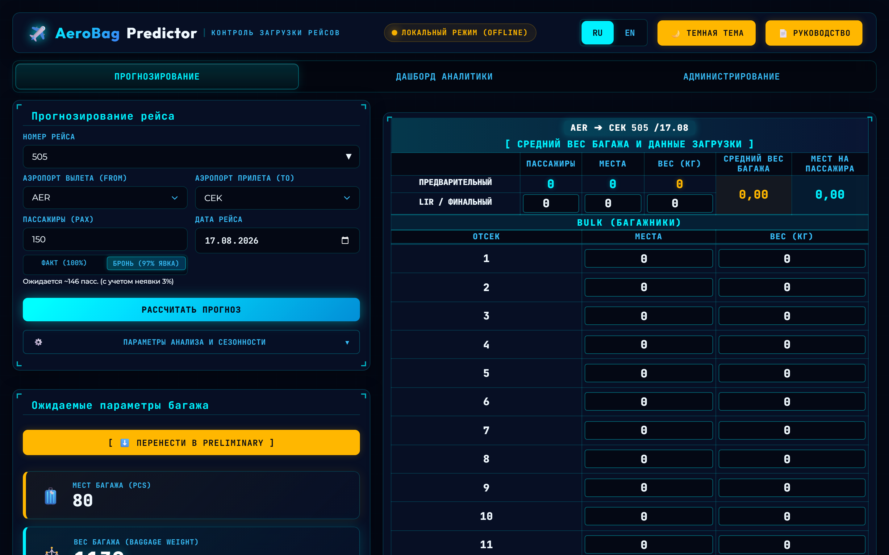
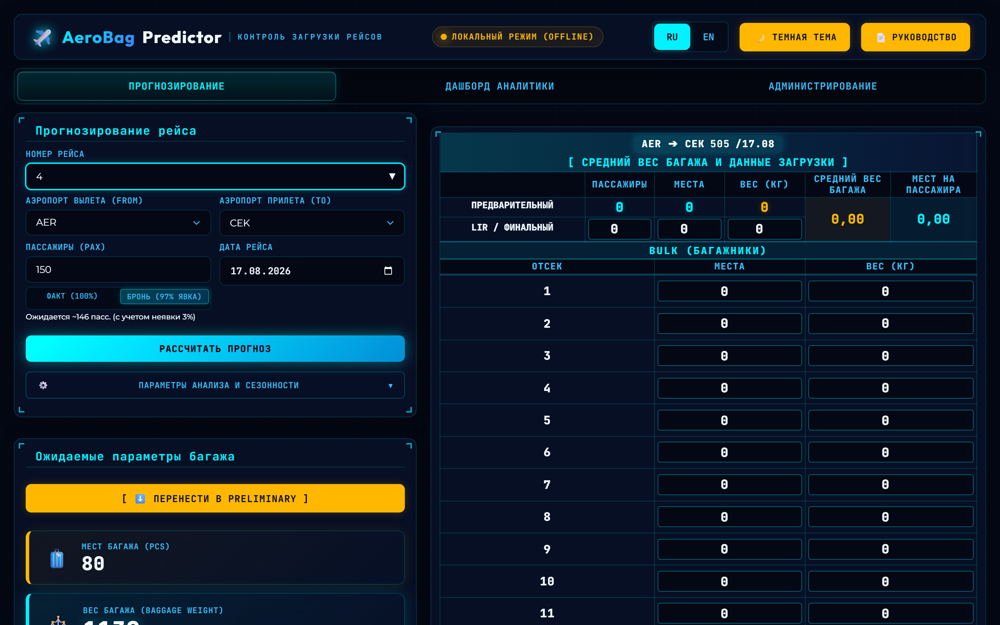
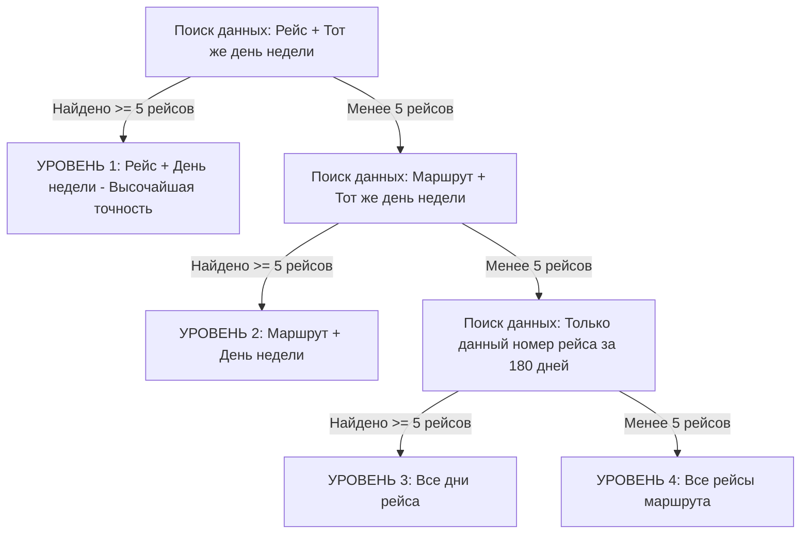
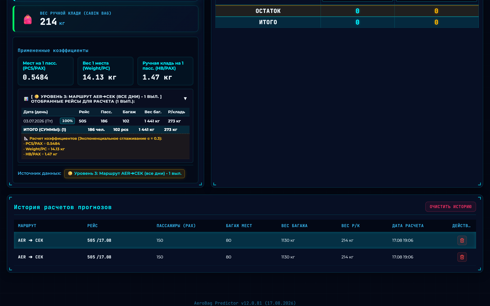
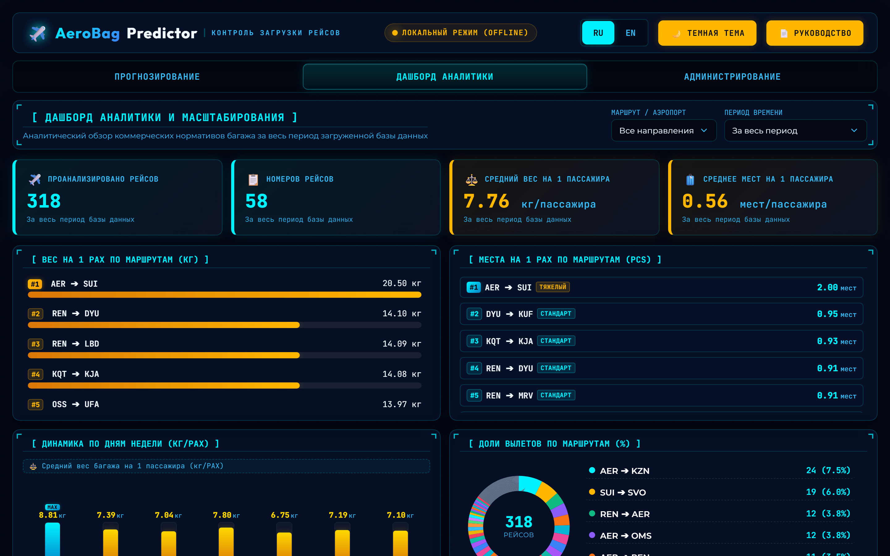
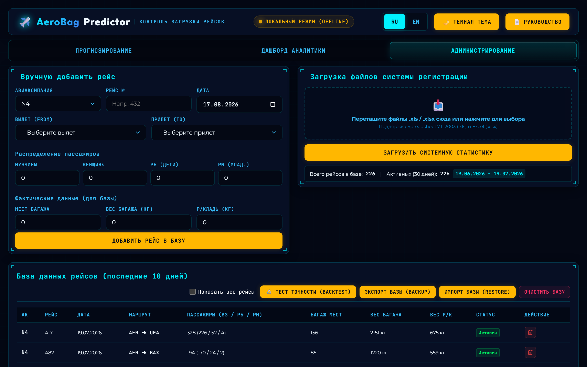
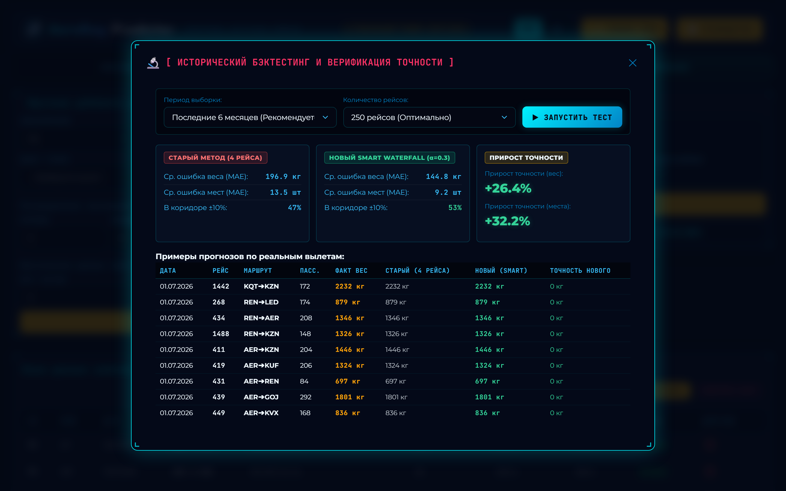

# РУКОВОДСТВО ПОЛЬЗОВАТЕЛЯ
## Программный комплекс AeroBag Predictor v12.0
### Подробная инструкция по эксплуатации для диспетчеров по центровке и контролю коммерческой загрузки ВС

---

## 1. Назначение программы и веб-доступ

Программный комплекс **AeroBag Predictor v12.0** предназначен для высокоточного автоматизированного прогнозирования и расчета коммерческой загрузки воздушных судов гражданской авиации (веса регистрируемого багажа и ручной клади).

Система рассчитывает ожидаемое количество мест багажа (**PCS**), суммарный коммерческий вес багажа (**кг**) и вес ручной клади (**кг**) на основе накопительной многолетней базы данных авиакомпании (более 7 900 реальных рейсов) с применением самообучающегося алгоритма **Smart Waterfall Engine**, экспоненциального сглаживания свежести рейсов ($\alpha = 0.3$), многолетней помесячной авто-сезонности и адаптивного учета явки пассажиров.

Применение результатов расчета AeroBag Predictor позволяет диспетчеру по центровке быстро, безошибочно и строго по стандартам IATA формировать:
* **Предварительный расчет загрузки (Preliminary Load Plan / PLP)**;
* **Сводно-загрузочную ведомость (CL / Cargo Load Sheet)**;
* **Инструкцию по загрузке и центровке (LIR / Loading Instruction/Report)**;
* **Электронную центровочную ведомость (Loadsheet)**.

Использование системы полностью исключает риск коммерческого перегруза багажно-грузовых отсеков (БГО) и предотвращает возникновение недопустимых центровочных смещений воздушного судна.

---

### Онлайн-доступ к программе:
Для работы с программой открывается любой современный веб-браузер (Google Chrome, Яндекс.Браузер, Microsoft Edge, Safari, Firefox) на рабочем компьютере или планшете диспетчера и выполняется переход по официальному веб-адресу системы:

👉 **`https://boostandgo.ru/aerobag/`**

> [!NOTE]
> **ОРИЕНТИР ДЛЯ ДИСПЕТЧЕРА**
> Программа функционирует полностью онлайн и не требует установки дополнительного стороннего программного обеспечения или драйверов. Все математические расчеты, фильтрация базы и построение центровки происходят мгновенно в защищенной веб-сессии.

---

### Авиационный интерфейс (HUD - Heads-Up Display):
Интерфейс программы спроектирован по стандарту эргономики кабинных дисплеев Glass Cockpit:
1. **Индикатор сетевого статуса**: зеленая пульсирующая точка и надпись **«ДИСПЕТЧЕР ОНЛАЙН»** подтверждают активное защищенное соединение с центральной базой данных.
2. **Переключатель языков (`RU` / `EN`)**: мгновенная смена языка интерфейса, таблиц, графиков и отчетов без перезагрузки страницы.
3. **Переключатель темы (`🌙 Темная тема` / `☀️ Светлая тема`)**: переключение между высококонтрастным темным авиационным HUD-режимом (для снижения нагрузки на зрение в ночную смену) и дневным светлым режимом.
4. **Кнопка «📄 Руководство»**: моментальное открытие данного справочного руководства.
5. **Вкладки навигации**:
   - **`Прогнозирование`** — основное рабочее место расчета норм багажа и распределения по отсекам;
   - **`Дашборд аналитики`** — визуальные графики удельных норм, рейтингов маршрутов и динамики по дням недели;
   - **`Администрирование`** — импорт отчетов систем регистрации Astra DCS, ручной ввод рейсов, бэктестинг и экспорт базы.

---

## 2. Прогнозирование коммерческой загрузки (Вкладка «Прогнозирование»)

Расчет прогноза коммерческой загрузки выполняется диспетчером всего за 3 простых шага:

### Шаг 1. Ввод номера рейса
Введите номер рейса в поле **«Номер рейса (FLT NO)»** (например, `505`, `409` или `101`).
При вводе первых цифр программа автоматически раскрывает выпадающее HUD-меню с интерактивными подсказками рейсов из базы данных, содержащими номер рейса, авиакомпанию и маршрут.

При клике на нужный рейс мышью (или при выборе клавишами `↓` / `Enter`) аэропорты вылета (**DEP / FROM**) и прилета (**ARR / TO**) подставляются в форму автоматически!

---

### Шаг 2. Проверка маршрута, ввод пассажиров и даты
1. **Маршрут**: Проверьте трехбуквенные коды IATA аэропортов вылета и прилета (например, `AER ➔ KZN` — Сочи ➔ Казань).
2. **Пассажиры (PAX)**: Укажите количество пассажиров по бронированию или регистрации (по умолчанию `150`).
3. **Режим явки пассажиров**:
   - **`Бронь (97% явка)`** *(Рекомендуется при предварительном расчете)*: автоматически умножает количество забронированных мест на коэффициент явки **`0.97`** (статистический no-show в гражданской авиации составляет 3%). В подсказке под полем выводится точное ожидаемое число явившихся пассажиров (например, `150 забронировано → 146 на посадке`).
   - **`Факт (100%)`** *(Применяется после окончания регистрации)*: расчет строго на фактически явившееся число пассажиров без коэффициента сбавки.
4. **Дата рейса**: Выберите планируемую дату вылета (по умолчанию устанавливается сегодняшняя дата).

---

### Шаг 3. Расчет
Нажмите янтарную кнопку **«РАССЧИТАТЬ ПРОГНОЗ»** (или нажмите клавишу `Enter` на клавиатуре).

Программа мгновенно выполнит многофакторный математический анализ и отобразит 3 ключевые карточки результатов:
* 🧳 **Мест багажа (PCS)** — прогнозируемое общее количество чемоданов и сумок в багажнике.
* ⚖️ **Вес багажа (BAG WEIGHT, кг)** — суммарная расчетная масса багажа для центровки ВС.
* 🎒 **Ручная кладь (CABIN BAG, кг)** — ожидаемый суммарный вес ручной клади в пассажирском салоне.

В нижней информационной панели отображаются итоговые удельные нормативы:
* **PCS/PAX** — среднее число мест багажа на 1 пассажира;
* **Weight/PC** — средняя масса одного места багажа (кг);
* **HB/PAX** — средняя масса ручной клади на 1 пассажира (кг).

---

## 3. Математическое ядро Smart Waterfall Engine v12.0

В версии **v12.0** внедрена принципиально новая архитектура прогнозирования, устраняющая погрешности традиционного арифметического усреднения.

### 1. Метод взвешенного отношения сумм ($\text{Weighted Ratio}$)
В классических алгоритмах средний удельный вес считался как среднее от частных $(\frac{W_1}{P_1} + \frac{W_2}{P_2} + \dots) / N$. Если в базе встречался рейс с малой загрузкой (например, 15 пассажиров и 300 кг), он искажал весь прогноз.

В AeroBag v12.0 применяется каноническое отношение сумм:
$$\text{Weight/PAX} = \frac{\sum (W_i \cdot w_i)}{\sum (P_i \cdot w_i)}$$
$$\text{PCS/PAX} = \frac{\sum (\text{PCS}_i \cdot w_i)}{\sum (P_i \cdot w_i)}$$
где $w_i$ — весовой коэффициент свежести конкретного рейса.

---

### 2. Экспоненциальное сглаживание свежести рейсов ($\alpha = 0.3$)
Пассажиропоток и багажные привычки меняются во времени. Поэтому самый последний выполненный рейс несет больше ценной информации, чем рейс 4 месяца назад.

Программа ранжирует исторические вылеты от самых свежих к старым и присваивает каждому рейсу экспоненциальный вес:
$$w_i = \alpha \cdot (1 - \alpha)^{i - 1} = 0.30 \cdot (0.70)^{i - 1}$$

| Порядковый номер рейса (от свежего) | Доля влияния в расчете ($w_i$) |
| :--- | :--- |
| **Рейс 1 (Самый свежий)** | **30.0%** |
| **Рейс 2** | **21.0%** |
| **Рейс 3** | **14.7%** |
| **Рейс 4** | **10.3%** |
| **Рейс 5** | **7.2%** |
| **Рейс 6 и далее** | Убывающий хвост влияния |

В таблице отобранных рейсов возле каждого рейса выводится яркий бейдж с его точным весом свежести (`30%`, `21%`, `15%`...).

---

### 3. Четырехуровневая каскадная иерархия (4-Level Smart Waterfall)
Система динамически выбирает максимально точный уровень выборки с порогом надёжности **не менее 5 рейсов** за последние 180 дней (до 20 самых свежих вылетов):

* **Уровень 1 (`Рейс + День недели`)**: максимальная точность (например, пятничные рейсы N4-505 сравниваются строго с пятничными вылетами N4-505).
* **Уровень 2 (`Маршрут + День недели`)**: если конкретный номер рейса выполнялся редко, программа объединяет все пятничные вылеты данного направления (Сочи ➔ Казань).
* **Уровень 3 (`Все дни рейса`)**: выборка по всем дням недели данного номера рейса.
* **Уровень 4 (`Все рейсы маршрута`)**: генеральная совокупность направления.

---

### 4. Автоматическая помесячная сезонность (Multi-Year Auto-Seasonality)
В базу данных заложена историческая матрица сезонных колебаний по 7 939 рейсам за 3 года. Система автоматически сопоставляет месяц вылета с базовым годовым уровнем направления:
$$\text{Итоговый вес} = \text{Расчетный вес} \times K_{\text{сезонность}}$$
Если рейс вылетает в пиковый отпускной месяц (июль/август), система автоматически применяет повышающий коэффициент (например, $\times 1.10$, $+10\%$), отображая бейдж **`СЕЗОННОСТЬ: x1.10 (+10%)`** прямо в результатах расчета.

---

## 4. Распределение багажа по отсекам (PRELIMINARY, LIR и BULK)

После выполнения расчета нажмите кнопку **`[ ⬇️ ПЕРЕНЕСТИ В PRELIMINARY ]`**. Все рассчитанные данные пассажиров, мест и массы мгновенно скопируются в правую рабочую панель планирования загрузки.

### Структура таблицы центровки:
1. **Строка PRELIMINARY (Предварительный расчет)** — содержит расчетные нормативы системы AeroBag.
2. **Строка LIR OR FINAL (Фактический расчет)** — заполняется диспетчером фактическими данными после закрытия регистрации рейса.
3. **Строки багажных отсеков (BULK 1 .. BULK 12 / Compartments)**:
   - Вводите количество мест багажа (**PCS**) в ячейки напротив нужных отсеков (например, 50 мест в БГО 1, 45 мест в БГО 2, 39 мест в БГО 3).
   - Программа автоматически умножает количество мест на средний вес чемодана и вычисляет расчетную массу каждого отсека.

---

### Ручная фиксация веса в отсеке (Золотая неоновая рамка):
Если конкретный багажный отсек или сетка были фактически взвешены на перроне, и их масса отличается от средней:
1. Введите точный фактический вес в кг в ячейку **«ВЕС (кг)»** отсека.
2. Ячейка мгновенно подсветится **золотой неоновой рамкой**, фиксируя данное значение.
3. Программа автоматически вычтет зафиксированную массу из общего веса рейса и **пропорционально перераспределит остаток по остальным незафиксированным отсекам**!
4. Нераспределенный остаток (**REST**) внизу таблицы автоматически сводится строго к **`0 кг`**.
5. Для сброса фиксации достаточно изменить число мест (PCS) в данной строке.

---

## 5. Вкладка «Дашборд аналитики» (Analytics Dashboard)

Вкладка **«Дашборд аналитики»** предоставляет диспетчеру наглядный графический обзор коммерческих норм багажа по всей накопленной базе полетов.

### Состав аналитических панелей:
1. **Фильтры дашборда**:
   - **`МАРШРУТ / АЭРОПОРТ`**: выбор конкретного направления или режим «Все направления»;
   - **`ВРЕМЕННОЙ ПЕРИОД`**: «За все время», «Последние 30 дней», «Последние 90 дней», «Последние 180 дней», «Текущий год».
2. **График 1: Удельный вес багажа на пассажира (кг/пасс)**: горизонтальный рейтинг направлений с цветовой индикацией загрузки.
3. **График 2: Удельное количество мест на пассажира (мест/пасс)**: рейтинг направлений со статусами загрузки:
   - 🔴 **`ТЯЖЕЛЫЙ` / `HEAVY`** ($\ge 0.90$ мест/пасс) — отпускные и курортные направления с высокой загрузкой багажников;
   - 🟡 **`СТАНДАРТ` / `STANDARD`** ($0.65 – 0.89$ мест/пасс) — сбалансированные регулярные рейсы;
   - 🟢 **`ЛЕГКИЙ` / `LIGHT`** ($< 0.65$ мест/пасс) — деловые челночные рейсы с минимумом багажа.
4. **График 3: Динамика коммерческой загрузки по дням недели**: вертикальные столбчатые диаграммы загрузки от понедельника (**ПН**) до воскресенья (**ВС**).
5. **График 4: Распределение рейсов по направлениям**: круговая диаграмма долей вылетов с общим счетчиком рейсов в центре.

---

## 6. Вкладка «Администрирование» и Верификация точности (Backtesting)

Раздел администрирования предназначен для управления базой рейсов, загрузки отчетов и тестирования математических моделей. Вход защищен паролем диспетчера:

🔑 Пароль доступа: **`NW2026`**

---

### 1. Модуль исторического бэктестинга (Backtesting & Accuracy Verification)
Кнопка **`[ 🔬 Тест точности (Backtest) ]`** запускает сертифицированный симулятор точности прогнозирования.

Система выполняет ретроспективную симуляцию прогнозов на сотнях реальных выполненных рейсов из базы:
* Для каждого вылета берутся только те данные, которые были известны **до момента вылета** (принцип чистой симуляции без заглядывания в будущее).
* Выполняется параллельный расчет по **Старому методу** (4 рейса / 60 дней) и **Новому Smart Waterfall v12.0** ($\alpha=0.3$ + авто-сезонность + 97% явка).
* На экран выводятся точные метрики:
  - **MAE (Средняя абсолютная ошибка)** по весу и местам;
  - **Процент попадания в коридор точности $\pm 10\%$**;
  - **Чистый прирост точности (Gain %)** и подробная таблица с порейсовым сравнением.

---

### 2. Загрузка отчетов (Drag & Drop)
Для массового пополнения базы данных:
* Перетащите файл отчета формата `.xls` или `.xlsx` в пунктирную область **Drag & Drop**.
* Программа автоматически распознает структуру отчета Astra DCS, извлечет фактические данные по пассажирам, местам багажа, весу багажа и ручной клади, отфильтрует заголовки и обновит базу.

### 3. Ручной ввод рейса (Manual Flight Entry)
Позволяет вручную внести выполненный рейс:
- Выбор авиакомпании (`N4` / `EO`), ввод номера рейса и даты;
- Выбор аэропортов вылета и прилета из списка или ввод произвольного 3-буквенного IATA-кода;
- Ввод количества мужчин, женщин, детей (**РБ**) и младенцев (**РМ**);
- Ввод мест багажа, массы багажа и веса ручной клади.

### 4. Резервное копирование базы (Backup & Restore):
* **`Экспорт базы (Backup)`** — скачивает защищенный файл базы `.json` на компьютер.
* **`Импорт базы (Restore)`** — восстанавливает базу данных из `.json` файла.
* **`Очистить базу`** — удаление базы данных с двойным подтверждением.

---

## 7. Пошаговая выгрузка отчетов из системы регистрации Astra DCS

Для регулярного пополнения базы данных свежими отчетами используйте стандартную процедуру экспорта из системы Astra DCS:

### Шаг 1
В главном меню программы Astra DCS откройте раздел **«Статистика»**.

### Шаг 2
В поле «Детализация» выберите тип отчета **«Подробная»**. В поле «Код а/к» укажите `N4` (или `EO`), задайте период дат и нажмите кнопку **«Выполнить»**.

### Шаг 3
В нижнем меню нажмите **«Печать»** и выберите пункт **«Стандартный формат»**.

### Шаг 4
В появившемся окне настроек печати нажмите кнопку **«Экспорт»** (вместо предварительного просмотра).

### Шаг 5
В списке доступных форматов выберите пункт **`Excel table (XML)...`** и нажмите «ОК».

### Шаг 6
Сохраните сформированный файл `.xls` на диск компьютера и перетащите его мышью в область **Drag & Drop** вкладки «Администрирование» в программе AeroBag Predictor. База данных обновится автоматически за 1 секунду!

---

## 8. Горячие клавиши и быстрая навигация для диспетчера

1. **Быстрый расчет клавишей `Enter`**:
   - После ввода номера рейса и пассажиров нажмите `Enter` в любом поле — расчет выполнится мгновенно.
2. **Переход по полям клавишей `TAB`**:
   - В форме прогноза `TAB` последовательно переключает поля: Номер рейса ➔ Аэропорт вылета ➔ Аэропорт прилета ➔ Пассажиры ➔ Дата ➔ Кнопка «Рассчитать».
   - В таблице отсеков **BULK** клавиша `TAB` перемещает курсор строго сверху вниз по столбцу мест (**PCS**), а затем по столбцу весов (**кг**).
3. **Автовыделение значений**:
   - При клике или переходе в любую ячейку старое число выделяется автоматически — можно сразу вводить новые цифры без предварительного стирания клавишей Backspace.
4. **Перенос из истории в 1 клик**:
   - Нажатие на любую строку в таблице «История расчетов» мгновенно подгружает этот рейс в панель Preliminary и центровочную таблицу.
