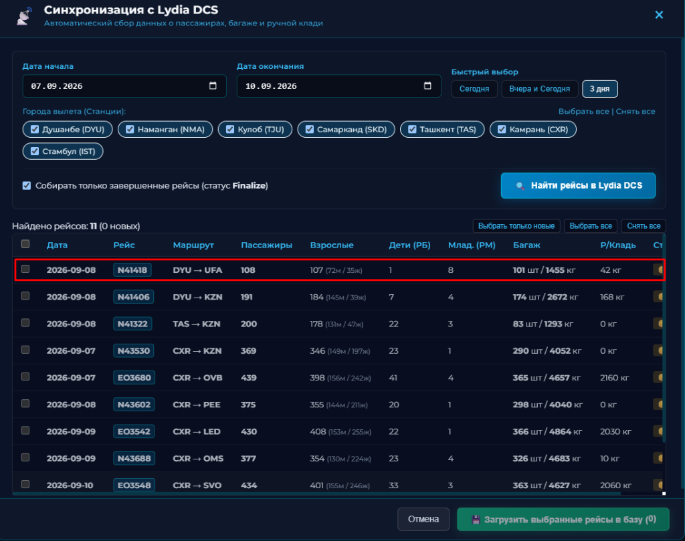

# РУКОВОДСТВО ПОЛЬЗОВАТЕЛЯ И АДМИНИСТРАТОРА
## Программный комплекс AeroBag Predictor v12.0
### Практическое руководство по эксплуатации для диспетчеров по центровке и администраторов системы

**Разработчик**: Andrey Zubkov  
**Версия**: v12.0 (2026)

---

# ОБЩИЕ СВЕДЕНИЯ И ВХОД В СИСТЕМУ

## 1. Назначение программы
Программный комплекс **AeroBag Predictor v12.0** предназначен для высокоточного автоматизированного прогнозирования и расчета коммерческой загрузки воздушных судов (веса регистрируемого багажа и ручной клади).

Система рассчитывает:
* **PCS** — ожидаемое количество мест багажа;
* **BAG WEIGHT (кг)** — суммарный вес багажа для центровочного графика и сводной ведомости;
* **CABIN BAG (кг)** — ожидаемую массу ручной клади в салоне.

Применение результатов расчета AeroBag Predictor позволяет диспетчеру быстро и безошибочно формировать:
* **Предварительный расчет загрузки (Preliminary Load Plan / PLP)**;
* **Инструкцию по загрузке и центровке (LIR / Loading Instruction/Report)**;
* **Сводно-загрузочную ведомость (Loadsheet)**.

---

## 2. Авторизация и доступ к системе

Программа работает онлайн через веб-браузер (Google Chrome, Яндекс.Браузер, Microsoft Edge, Safari, Firefox) на компьютере или планшете диспетчера.

При входе в программу отображается защищенное окно авторизации:

### Разграничение прав доступа:
1. **Диспетчер (`DISPATCHER`)**:
   - Доступны вкладки **«Прогнозирование»** и **«Дашборд аналитики»**.
   - Диспетчер выполняет оперативный расчет норм багажа, перенос в Preliminary, раскладку по отсекам БГО и просмотр графиков.
2. **Администратор (`ADMIN`)**:
   - Доступны **все 3 вкладки**: «Прогнозирование», «Дашборд аналитики» и «Администрирование».
   - Администратор дополнительно управляет учетными записями диспетчеров, сервером автобэкапов, загрузкой статистики Astra DCS и симулятором точности.

---

## 3. Элементы интерфейса (HUD Cockpit)

Верхняя панель спроектирована по стандартам эргономики кабинных дисплеев Glass Cockpit:

1. **Логотип и статус связи**:
   - `🟢 ДИСПЕТЧЕР ОНЛАЙН` — активное защищенное подключение к серверу MySQL.
   - `🟠 ЛОКАЛЬНЫЙ РЕЖИМ (OFFLINE)` — автономная работа без интернета на встроенной локальной базе.
2. **Профиль пользователя**: отображает бейдж роли (`ADMIN` / `DISPATCHER`), имя/позывной текущего сотрудника и кнопку **«🚪 Выход»**.
3. **Переключатель языка (`RU` / `EN`)**: моментальная смена языка всех таблиц, кнопок и подсказок в один клик.
4. **Переключатель темы (`🌙 Темная тема` / `☀️ Светлая тема`)**: переключение высококонтрастного темного авиационного режима для работы в ночную смену и дневного светлого режима.
5. **Кнопка «📄 Руководство»**: открытие справочного руководства по эксплуатации.

---

# ЧАСТЬ I. РУКОВОДСТВО ДИСПЕТЧЕРА

В этой части описаны все функции программы для повседневной оперативной работы диспетчера простым и понятным языком, без сложных математических терминов.

---

## 4. Прогнозирование рейса за 3 простых шага

### Шаг 1. Ввод номера рейса и умная подсказка
В поле **«Номер рейса (FLT NO)»** начните вводить номер вылета (например, `50` или `432`). 

Программа мгновенно откроет список рейсов из базы:

* Кликните по нужному рейсу — аэропорты вылета (**DEP / FROM**) и прилета (**ARR / TO**) подставятся автоматически.
* В поле **«Пассажиры (PAX)»** программа автоматически подставит историческое среднее число пассажиров для данного направления.

---

### Шаг 2. Проверка пассажиров и выбор режима явки
1. Укажите количество пассажиров по брони или регистрации.
2. Выберите режим явки:
   - **`ФАКТ (100%)`** *(По умолчанию)*: расчет ведется строго на указанное число пассажиров.
   - **`БРОНЬ (97% ЯВКА)`**: учитывает стандартную мировую сбавку 3% на неявившихся пассажиров (no-show). Под полем ввода сразу пишется точная подсказка, например: `150 забронировано → 146 на посадке`.
3. Дата рейса по умолчанию выставляется сегодняшняя.

---

### Шаг 3. Нажатие кнопки «Рассчитать прогноз»
Нажмите кнопку **«РАССЧИТАТЬ ПРОГНОЗ»** (или клавишу `Enter`).

Программа выдает 3 главных результата:
* 🧳 **Мест багажа (PCS)** — сколько всего мест багажа ожидается на рейсе.
* ⚖️ **Вес багажа (BAG WEIGHT, кг)** — суммарная масса багажа для центровочной ведомости.
* 🎒 **Ручная кладь (CABIN BAG, кг)** — расчетный вес ручной клади в салоне.

В строке нормативов снизу также отображаются:
* **PCS/PAX** — среднее количество сумок на одного пассажира;
* **Weight/PC** — средний вес одного чемодана (кг);
* **HB/PAX** — средний вес ручной клади на одного пассажира (кг).

---

## 5. Как программа подбирает рейсы (Понятная логика)

Программа не просто берет «среднее арифметическое», а отбирает самые похожие и свежие рейсы:

1. **Приоритет дню недели**: люди летают в пятницу или воскресенье с другим количеством вещей, чем во вторник. Программа в первую очередь ищет вылеты именно на этот день недели.
2. **Приоритет свежим рейсам**: рейсы, выполненные вчера или на прошлой неделе, имеют больший вес в расчете (до 30%), чем рейсы трехмесячной давности.
3. **Автоматический учет сезона**: летом на южных направлениях чемоданы объемнее и легче, а зимой добавляется теплое снаряжение — система автоматически учитывает текущий месяц.

Все отобранные рейсы с их датами, пассажирами и фактическим багажом открыто показаны в таблице под расчетом.

---

## 6. Распределение багажа по отсекам (BULK) и фиксация веса

После расчета нажмите кнопку **`[ ⬇️ ПЕРЕНЕСТИ В PRELIMINARY ]`**. Данные скопируются в правую панель планирования отсеков.

### Порядок работы с отсеками:
1. В столбце **«МЕСТА»** напротив нужных багажников (отсек 1, 2, 3, 4...) введите количество загружаемых сумок.
2. Программа автоматически умножит места на средний вес чемодана и заполнит столбец **«ВЕС (кг)»**.
3. **Фиксация веса (Золотая рамка)**:
   - Если один из отсеков (например, трансфер или негабарит) взвесили на весах и его точный вес известен, введите это число руками в поле веса.
   - Ячейка загорится **золотой рамкой** — вес зафиксирован.
   - Программа автоматически пересчитает остальные свободные отсеки так, чтобы общий вес рейса сошелся копейка в копейку, а остаток (**REST**) стал строго **`0 кг`**!
4. Чтобы снять фиксацию, просто измените количество мест в этой строке.

---

## 7. Вкладка «Дашборд аналитики»

Вкладка позволяет визуально оценить характер загрузки любого направления:

* **График 1: Удельный вес багажа (кг на пассажира)** — рейтинг самых «тяжелых» и «легких» направлений.
* **График 2: Мест на пассажира** — цветовые категории:
  - 🔴 **Тяжелый** ($\ge 0.90$ сумок/пасс) — курорты, отпускные рейсы;
  - 🟡 **Стандарт** ($0.65 – 0.89$) — обычные регулярные рейсы;
  - 🟢 **Легкий** ($< 0.65$) — деловые челночные направления.
* **График 3: Загрузка по дням недели (ПН-ВС)** — наглядные столбики для выявления пиковых дней.
* **График 4: Доли вылетов по направлениям** — процент каждого маршрута в общей программе полетов.

---

## 8. Горячие клавиши для быстрой работы

* **`Enter`** в поле номера рейса или пассажиров — мгновенный расчет прогноза.
* **`TAB`** — быстрый переход между полями ввода. В таблице отсеков клавиша `TAB` быстро ведет курсор сверху вниз по местам.
* **Автовыделение**: при клике в любое поле старое число выделяется само — не нужно стирать его клавишей `Backspace`, сразу вводите новое значение.
* **Клик по рейсу в истории**: восстанавливает раскладку отсеков и расчет в один клик.

---

# ЧАСТЬ II. РУКОВОДСТВО АДМИНИСТРАТОРА

В этой части подробно и простыми словами описаны все инструменты вкладки **«Администрирование»**: автоматическая загрузка данных из систем регистрации, управление фильтрами маршрутов, учетными записями диспетчеров, резервными копиями и проверкой точности.

---

## 9. Панель «Администрирование» (Общий обзор)

Вкладка **«Администрирование»** предназначена для руководящего состава и диспетчеров с правами администратора (роль `ADMIN`). 

Вход во вкладку защищен персональным паролем администратора.

### Основные возможности вкладки:
1. **Автоматическая синхронизация с Lydia DCS** — загрузка закрытых рейсов и манифестов регистрации в 1 клик.
2. **Загрузка файлов отчетов регистрации (Astra DCS / Excel)** — перетаскивание файлов `.xls` и `.xlsx`.
3. **Управление фильтрами маршрутов и городов** — настройка разрешенных аэропортов вылета и прилета.
4. **Ручной ввод рейса** — быстрое внесение одиночного рейса в базу.
5. **Управление учетными записями диспетчеров (RBAC)** — создание пользователей, назначение ролей и смена паролей.
6. **Автоматические резервные копии (30 дней)** — ежедневная защита данных и восстановление базы в 1 клик.
7. **Журнал базы данных рейсов** — просмотр, поиск и фильтрация всех рейсов в системе.
8. **Модуль проверки точности (Бэктестинг)** — аудит надежности прогнозов на реальной истории.

---

## 10. Автоматическая синхронизация с системой регистрации Lydia DCS

Модуль прямой интеграции с **Lydia DCS** позволяет импортировать данные о пассажирах и багаже напрямую из системы регистрации без ручного скачивания и загрузки файлов.

Кнопка **`📡 Синхронизация с Lydia DCS`** расположена в правой колонке под окном загрузки файлов статистики.

### Пошаговый порядок синхронизации:

1. **Открытие окна синхронизации**:
   - Нажмите кнопку **`📡 Синхронизация с Lydia DCS`** (подпись: *Парсинг закрытых рейсов в 1 клик*).

2. **Выбор периода вылетов**:
   - Укажите **Дату начала** и **Дату окончания** интересующего диапазона или воспользуйтесь кнопками быстрого выбора:
     - **`Сегодня`** — сбор рейсов за текущие сутки;
     - **`Вчера и Сегодня`** — сбор за вчерашний и сегодняшний дни (рекомендуется для регулярной работы);
     - **`3 дня`** — сбор за последние 3 суток.

3. **Выбор городов вылета (станций)**:
   - Отметьте нужные аэропорты отправления:
     - **Душанбе (DYU)**
     - **Наманган (NMA)**
     - **Куляб (TJU)**
     - **Самарканд (SKD)**
     - **Ташкент (TAS)**
     - **Камрань (CXR)**
     - **Стамбул (IST)**
   - Для выбора всех городов сразу нажмите ссылку **`Выбрать все`**.

4. **Фильтрация статуса рейсов**:
   - Флажок **«Собирать только завершенные рейсы (статус Finalize)»** включен по умолчанию. Это гарантирует, что в базу попадут только рейсы с полностью закрытой регистрацией и окончательными данными по пассажирам и багажу.

5. **Запуск поиска**:
   - Нажмите синюю кнопку **`🔍 Найти рейсы в Lydia DCS`**.
   - На экране появится живая шкала прогресса (0% – 100%), показывающая процесс подключения и статус сбора данных по каждому городу в реальном времени (например: `[3/7] Камрань (CXR)... (Найдено: 6)`).

6. **Проверка результатов в таблице предпросмотра**:
   - После завершения опроса откроется таблица с перечнем всех найденных рейсов:
     - **Дата и Рейс** (например, `2026-09-08` / `N41418`);
     - **Маршрут** (например, `DYU → UFA`);
     - **Пассажиры (PAX)** — общее число фактически зарегистрированных пассажиров (Взрослые + Дети);
     - **Взрослые** — количество взрослых пассажиров с разделением на мужчин и женщин (например, `107 (72м / 35ж)`);
     - **Дети (РБ)** — количество зарегистрированных детей от 2 до 12 лет;
     - **Младенцы (РМ)** — количество зарегистрированных младенцев до 2 лет без места;
     - **Багаж** — суммарное количество мест и общий фактический вес багажа (например, `101 шт / 1455 кг`);
     - **Р/Кладь** — общий вес ручной клади;
     - **Статус**:
       - `🟢 Новый` — рейс отсутствует в базе и готов к сохранению;
       - `🟡 В базе` — рейс уже был загружен ранее (при повторном импорте его данные аккуратно обновятся).

7. **Сохранение в базу данных**:
   - По умолчанию все новые рейсы уже отмечены галочками. При необходимости используйте кнопки **`Выбрать только новые`**, **`Выбрать все`** или **`Снять все`**.
   - Нажмите зеленую кнопку **`💾 Загрузить выбранные рейсы в базу`**.
   - Рейсы мгновенно запишутся в рабочую базу AeroBag Predictor и сразу будут учитываться в формулах прогнозирования и аналитике.

---

## 11. Пополнение базы через файлы отчетов Astra DCS (Excel)

Если у вас есть выгруженные отчеты из системы **Astra DCS**, их можно загрузить простым перетаскиванием:

1. Перетащите файл `.xls` или `.xlsx` в область **Drag & Drop** («Перетащите файлы сюда»).
2. Программа автоматически распознает структуру отчета, выделит рейсы и добавит их в базу.

### Инструкция по экспорту отчета из программы Astra DCS:

#### Шаг 1
В главном меню программы Astra DCS откройте раздел **«Статистика»**.

#### Шаг 2
В поле «Детализация» выберите тип отчета **«Подробная»**. В поле «Код а/к» укажите `N4` (или `EO`), задайте период дат и нажмите кнопку **«Выполнить»**.

#### Шаг 3
В нижнем меню нажмите **«Печать»** и выберите пункт **«Стандартный формат»**.

#### Шаг 4
В появившемся окне настроек печати нажмите кнопку **«Экспорт»** (вместо предварительного просмотра).

#### Шаг 5
В списке доступных форматов выберите пункт **`Excel table (XML)...`** и нажмите «ОК».

#### Шаг 6
Сохраните файл `.xls` на рабочий стол и перетащите его в зону загрузки AeroBag Predictor.

---

## 12. Управление фильтрами маршрутов и городов (Route Filters)

Панель **`[ INGESTION ROUTE & CITY FILTERS ]`** позволяет настраивать список разрешенных городов вылета и прилета, чтобы при загрузке файлов исключались посторонние или тестовые направления.

1. **Разворачивание панели**:
   - Нажмите кнопку **`▼ Развернуть`** в заголовке панели фильтров.
2. **Добавление города вылета или прилета**:
   - Введите код IATA (например, `AER`), код РФ (например, `СОЧ`) или русское название города (например, `Сочи`) в поле добавления и нажмите **`➕ Добавить`**.
3. **Удаление города**:
   - Нажмите значок **`×`** на плашке города.
4. **Строгий фильтр по прилетам**:
   - Чекбокс *«Включить строгий фильтр по прилетам»* активирует отбор рейсов, у которых совпадает не только пункт отправления, но и пункт назначения.
5. **Сброс по умолчанию**:
   - Кнопка **`↺ Сбросить по умолчанию`** возвращает полный стандартный перечень базовых аэропортов авиакомпании.

---

## 13. Ручной ввод отдельного рейса (Manual Flight Entry)

Форма в левой колонке позволяет администратору оперативно добавить единичный рейс:

1. Укажите **Дату полета** и **Номер рейса** (например, `509`).
2. Выберите **Аэропорт вылета (FROM)** и **Аэропорт прилета (TO)**.
3. Заполните блок распределения пассажиров:
   - **Мужчины (ВЗ)** и **Женщины (ВЗ)** — взрослые пассажиры;
   - **Дети (РБ)** — дети от 2 до 12 лет;
   - **Младенцы (РМ)** — младенцы до 2 лет.
4. Укажите фактические данные загрузки:
   - **Мест багажа** (шт);
   - **Вес багажа** (кг);
   - **Р/кладь** (кг).
5. Нажмите кнопку **`Добавить рейс в базу`**. Рейс сразу отобразится в таблице базы.

---

## 14. Управление учетными записями диспетчеров (RBAC)

Панель **`[ ACCESS CONTROL & USER MANAGEMENT ]`** предназначена для создания пользователей и разграничения прав доступа:

1. **Создание нового пользователя**:
   - Нажмите кнопку **`➕ Добавить пользователя`**.
   - Заполните **Логин** (например, `DISP_LED`), **ФИО** (например, `Смирнов А.В.`), укажите **Роль**:
     - `Диспетчер` — доступ только к прогнозированию и аналитическому дашборду;
     - `Администратор` — полный доступ ко всем разделам и управлению базой.
   - Введите пароль (используйте кнопку 👁️ для проверки введенных символов) и нажмите «Сохранить».
2. **Смена пароля**:
   - Нажмите кнопку **`🔑 Пароль`** в строке сотрудника, введите новый пароль и подтвердите сохранение.
3. **Блокировка и редактирование**:
   - Кнопка **`✏️`** позволяет изменить ФИО, роль или временно заблокировать учетную запись без удаления ее истории.
4. **Удаление учетной записи**:
   - Кнопка **`🗑️`** удаляет пользователя из системы после подтверждения.

---

## 15. Автоматические ежедневные бэкапы (30 дней)

Система AeroBag Predictor оснащена встроенным механизмом защиты данных от сбоев:

1. **Автоматическое резервное копирование**:
   - Каждые сутки при первой активности система автоматически создает архивный снимок всей базы рейсов.
   - Сервер хранит архив за последние **30 дней**, автоматически очищая более старые копии (ротация).
2. **Создание копии вручную**:
   - Нажмите кнопку **`⚡ Создать бэкап сейчас`** — резервная копия сформируется за доли секунды.
3. **Скачивание на компьютер**:
   - Нажмите кнопку **`📥 Скачать`** напротив любого снимка, чтобы сохранить файл архива `.json` на свой рабочий компьютер.
4. **Восстановление базы в 1 клик**:
   - При необходимости вернуть состояние базы на определенную дату нажмите **`🔄 Восстановить`**. Все данные мгновенно вернутся к состоянию выбранного снимка.

---

## 16. Модуль проверки точности (Бэктестинг)

Кнопка **`[ 🔬 Тест точности (Backtest) ]`** запускает исторический симулятор расчетов:

1. Выберите период проверки (за месяц, квартал, полугодие или за все время).
2. Нажмите **`▶ Запустить тест`**.
3. Программа промоделирует реальные рейсы и покажет наглядный отчет:
   - **Среднюю ошибку веса багажа (MAE, кг)**;
   - **Среднюю ошибку по местам багажа (MAE, шт)**;
   - **Процент попадания в коридор точности $\pm 10\%$**;
   - Возможность скачать детальный отчет в формате **Excel** с цветовой маркировкой точности.

---

**AeroBag Predictor v12.0** — надежный инструмент коммерческой загрузки и безопасности полетов.

