# РУКОВОДСТВО ПОЛЬЗОВАТЕЛЯ И АДМИНИСТРАТОРА
## Программный комплекс AeroBag Predictor v12.0
### Практическое руководство по эксплуатации для диспетчеров по центровке и администраторов системы

**Разработчик**: Andrey Zubkov  
**Версия**: v12.0 (2026)

---

# ОБЩИЕ СВЕДЕНИЯ И ВХОД В СИСТЕМУ

## 1. Назначение программы
Программный комплекс **AeroBag Predictor v12.0** предназначен для высокоточного автоматизированного прогнозирования и расчета коммерческой загрузки воздушных судов (веса регистрируемого багажа и ручной клади).

Система рассчитывает:
* **PCS** — ожидаемое количество мест багажа;
* **BAG WEIGHT (кг)** — суммарный вес багажа для центровочного графика и сводной ведомости;
* **CABIN BAG (кг)** — ожидаемую массу ручной клади в салоне.

Применение результатов расчета AeroBag Predictor позволяет диспетчеру быстро и безошибочно формировать:
* **Предварительный расчет загрузки (Preliminary Load Plan / PLP)**;
* **Инструкцию по загрузке и центровке (LIR / Loading Instruction/Report)**;
* **Сводно-загрузочную ведомость (Loadsheet)**.

---

## 2. Авторизация и доступ к системе

Программа работает онлайн через веб-браузер (Google Chrome, Яндекс.Браузер, Microsoft Edge, Safari, Firefox) на компьютере или планшете диспетчера.

При входе в программу отображается защищенное окно авторизации:

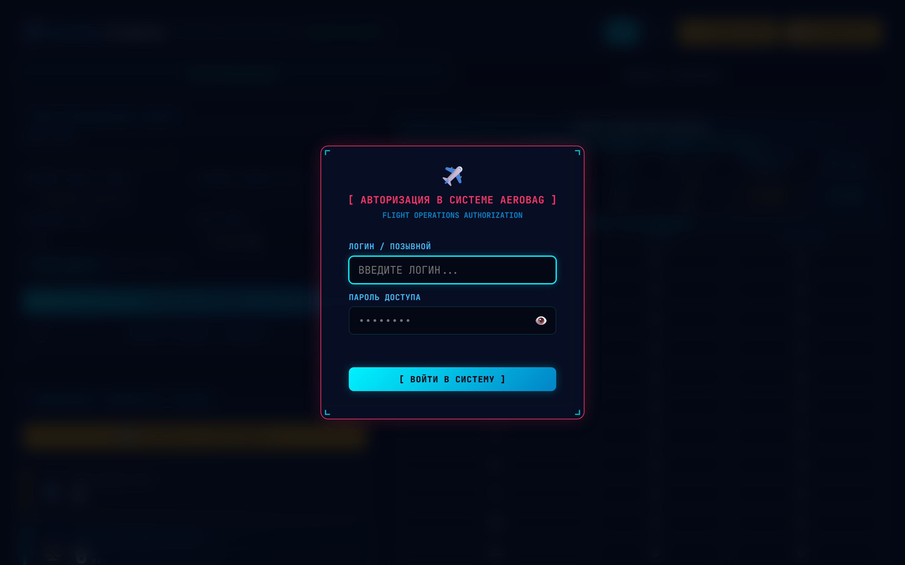

### Разграничение прав доступа:
1. **Диспетчер (`DISPATCHER`)**:
   - Доступны вкладки **«Прогнозирование»** и **«Дашборд аналитики»**.
   - Диспетчер выполняет оперативный расчет норм багажа, перенос в Preliminary, раскладку по отсекам БГО и просмотр графиков.
2. **Администратор (`ADMIN`)**:
   - Доступны **все 3 вкладки**: «Прогнозирование», «Дашборд аналитики» и «Администрирование».
   - Администратор дополнительно управляет учетными записями диспетчеров, сервером автобэкапов, загрузкой статистики Astra DCS и симулятором точности.

---

## 3. Элементы интерфейса (HUD Cockpit)

Верхняя панель спроектирована по стандартам эргономики кабинных дисплеев Glass Cockpit:

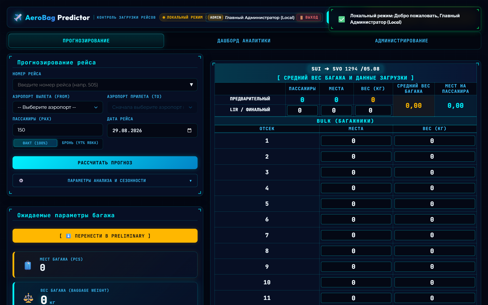

1. **Логотип и статус связи**:
   - `🟢 ДИСПЕТЧЕР ОНЛАЙН` — активное защищенное подключение к серверу MySQL.
   - `🟠 ЛОКАЛЬНЫЙ РЕЖИМ (OFFLINE)` — автономная работа без интернета на встроенной локальной базе.
2. **Профиль пользователя**: отображает бейдж роли (`ADMIN` / `DISPATCHER`), имя/позывной текущего сотрудника и кнопку **«🚪 Выход»**.
3. **Переключатель языка (`RU` / `EN`)**: моментальная смена языка всех таблиц, кнопок и подсказок в один клик.
4. **Переключатель темы (`🌙 Темная тема` / `☀️ Светлая тема`)**: переключение высококонтрастного темного авиационного режима для работы в ночную смену и дневного светлого режима.
5. **Кнопка «📄 Руководство»**: открытие справочного руководства по эксплуатации.

---

# ЧАСТЬ I. РУКОВОДСТВО ДИСПЕТЧЕРА

В этой части описаны все функции программы для повседневной оперативной работы диспетчера простым и понятным языком, без сложных математических терминов.

---

## 4. Прогнозирование рейса за 3 простых шага

### Шаг 1. Ввод номера рейса и умная подсказка
В поле **«Номер рейса (FLT NO)»** начните вводить номер вылета (например, `50` или `432`). 

Программа мгновенно откроет список рейсов из базы:

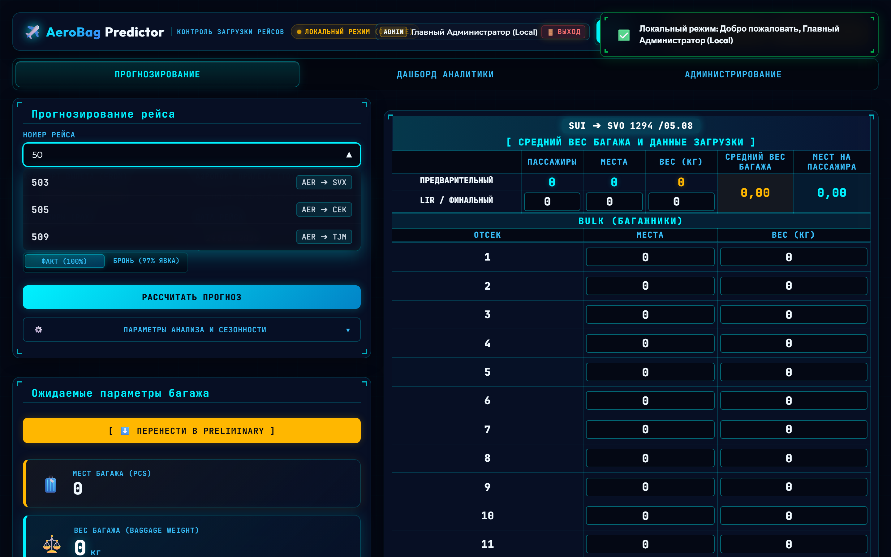

* Кликните по нужному рейсу — аэропорты вылета (**DEP / FROM**) и прилета (**ARR / TO**) подставятся автоматически.
* В поле **«Пассажиры (PAX)»** программа автоматически подставит историческое среднее число пассажиров для данного направления.

---

### Шаг 2. Проверка пассажиров и выбор режима явки
1. Укажите количество пассажиров по брони или регистрации.
2. Выберите режим явки:
   - **`ФАКТ (100%)`** *(По умолчанию)*: расчет ведется строго на указанное число пассажиров.
   - **`БРОНЬ (97% ЯВКА)`**: учитывает стандартную мировую сбавку 3% на неявившихся пассажиров (no-show). Под полем ввода сразу пишется точная подсказка, например: `150 забронировано → 146 на посадке`.
3. Дата рейса по умолчанию выставляется сегодняшняя.

---

### Шаг 3. Нажатие кнопки «Рассчитать прогноз»
Нажмите кнопку **«РАССЧИТАТЬ ПРОГНОЗ»** (или клавишу `Enter`).

Программа выдает 3 главных результата:
* 🧳 **Мест багажа (PCS)** — сколько всего мест багажа ожидается на рейсе.
* ⚖️ **Вес багажа (BAG WEIGHT, кг)** — суммарная масса багажа для центровочной ведомости.
* 🎒 **Ручная кладь (CABIN BAG, кг)** — расчетный вес ручной клади в салоне.

В строке нормативов снизу также отображаются:
* **PCS/PAX** — среднее количество сумок на одного пассажира;
* **Weight/PC** — средний вес одного чемодана (кг);
* **HB/PAX** — средний вес ручной клади на одного пассажира (кг).

---

## 5. Как программа подбирает рейсы (Понятная логика)

Программа не просто берет «среднее арифметическое», а отбирает самые похожие и свежие рейсы:

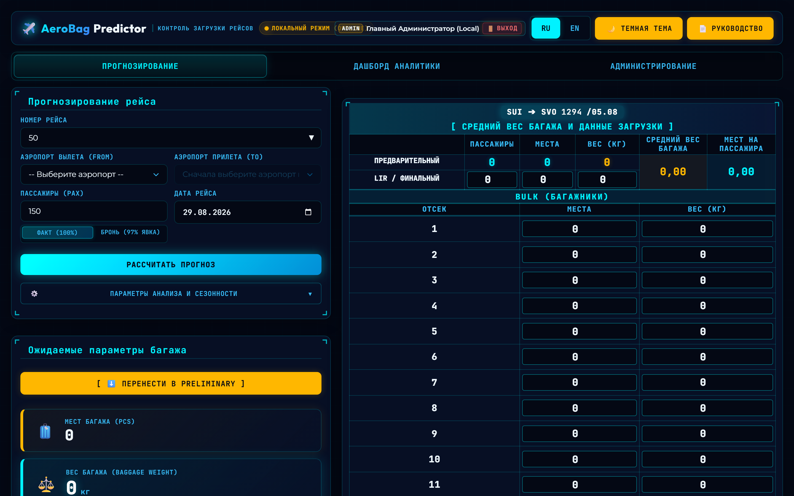

1. **Приоритет дню недели**: люди летают в пятницу или воскресенье с другим количеством вещей, чем во вторник. Программа в первую очередь ищет вылеты именно на этот день недели.
2. **Приоритет свежим рейсам**: рейсы, выполненные вчера или на прошлой неделе, имеют больший вес в расчете (до 30%), чем рейсы трехмесячной давности.
3. **Автоматический учет сезона**: летом на южных направлениях чемоданы объемнее и легче, а зимой добавляется теплое снаряжение — система автоматически учитывает текущий месяц.

Все отобранные рейсы с их датами, пассажирами и фактическим багажом открыто показаны в таблице под расчетом.

---

## 6. Распределение багажа по отсекам (BULK) и фиксация веса

После расчета нажмите кнопку **`[ ⬇️ ПЕРЕНЕСТИ В PRELIMINARY ]`**. Данные скопируются в правую панель планирования отсеков.

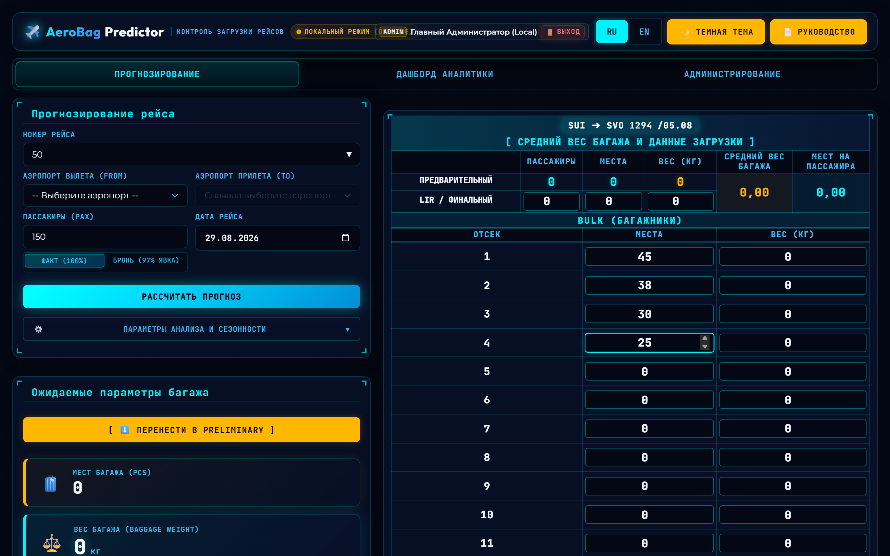

### Порядок работы с отсеками:
1. В столбце **«МЕСТА»** напротив нужных багажников (отсек 1, 2, 3, 4...) введите количество загружаемых сумок.
2. Программа автоматически умножит места на средний вес чемодана и заполнит столбец **«ВЕС (кг)»**.
3. **Фиксация веса (Золотая рамка)**:
   - Если один из отсеков (например, трансфер или негабарит) взвесили на весах и его точный вес известен, введите это число руками в поле веса.
   - Ячейка загорится **золотой рамкой** — вес зафиксирован.
   - Программа автоматически пересчитает остальные свободные отсеки так, чтобы общий вес рейса сошелся копейка в копейку, а остаток (**REST**) стал строго **`0 кг`**!
4. Чтобы снять фиксацию, просто измените количество мест в этой строке.

---

## 7. Вкладка «Дашборд аналитики»

Вкладка позволяет визуально оценить характер загрузки любого направления:

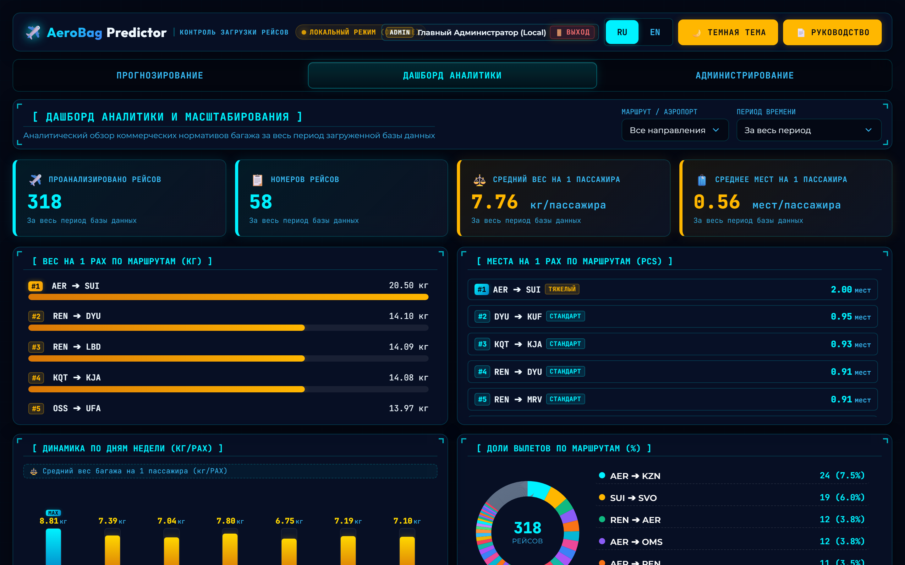

* **График 1: Удельный вес багажа (кг на пассажира)** — рейтинг самых «тяжелых» и «легких» направлений.
* **График 2: Мест на пассажира** — цветовые категории:
  - 🔴 **Тяжелый** ($\ge 0.90$ сумок/пасс) — курорты, отпускные рейсы;
  - 🟡 **Стандарт** ($0.65 – 0.89$) — обычные регулярные рейсы;
  - 🟢 **Легкий** ($< 0.65$) — деловые челночные направления.
* **График 3: Загрузка по дням недели (ПН-ВС)** — наглядные столбики для выявления пиковых дней.
* **График 4: Доли вылетов по направлениям** — процент каждого маршрута в общей программе полетов.

---

## 8. Горячие клавиши для быстрой работы

* **`Enter`** в поле номера рейса или пассажиров — мгновенный расчет прогноза.
* **`TAB`** — быстрый переход между полями ввода. В таблице отсеков клавиша `TAB` быстро ведет курсор сверху вниз по местам.
* **Автовыделение**: при клике в любое поле старое число выделяется само — не нужно стирать его клавишей `Backspace`, сразу вводите новое значение.
* **Клик по рейсу в истории**: восстанавливает раскладку отсеков и расчет в один клик.

---

# ЧАСТЬ II. РУКОВОДСТВО АДМИНИСТРАТОРА

В этой части описаны функции администрирования системы, управления учетными записями, резервным копированием и загрузкой данных.

---

## 9. Панель «Администрирование»

Вкладка **«Администрирование»** доступна только пользователям с ролью `ADMIN`.

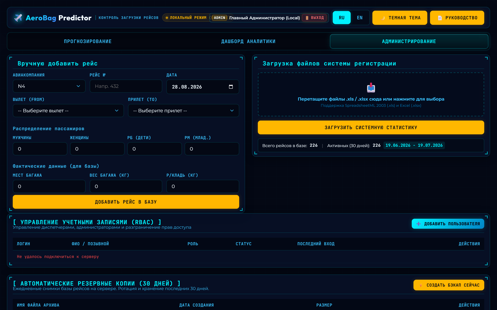

### Разделы вкладки:
1. **Ручной ввод рейса (`MANUAL FLIGHT ENTRY`)**: добавление разовых рейсов в базу вручную.
2. **Загрузка статистики (`STATISTICS FILE INGESTION`)**: загрузка файлов отчетов `.xls`/`.xlsx`.
3. **Управление учетными записями (`RBAC`)**: создание диспетчеров и выдача паролей.
4. **Автоматические резервные копии (30 дней)**: создание и восстановление бэкапов.
5. **База данных рейсов**: журнал всех вылетов за последние 10 дней с поиском и удалением.

---

## 10. Управление учетными записями диспетчеров (RBAC)

Панель позволяет полностью администрировать доступ к приложению:

1. **Добавление нового пользователя**:
   - Нажмите кнопку **`➕ Добавить пользователя`**.
   - Укажите **Логин** (например, `DISP_SVO`), **ФИО** (например, `Иванов И.И.`), выберите **Роль** (`Диспетчер` или `Администратор`) и задайте пароль.
   - Нажмите «Сохранить».
2. **Смена пароля**:
   - Нажмите кнопку **`🔑 Пароль`** в строке нужного пользователя, введите новый пароль и подтвердите его.
3. **Блокировка / Редактирование**:
   - Нажмите **`✏️`** для изменения роли или временной блокировки учетной записи (без удаления истории).
4. **Удаление**:
   - Кнопка **`🗑️`** удаляет учетную запись с подтверждением.

---

## 11. Автоматические бэкапы базы данных (30 дней)

Система ведет автоматические ежедневные снимки базы полетов на сервере.

1. **Авторотация 30 дней**: сервер хранит копии за последний месяц, автоматически удаляя устаревшие файлы и экономя место.
2. **Создание копии вручную**:
   - Нажмите кнопку **`⚡ Создать бэкап сейчас`**. В таблице мгновенно появится новый архив с точным временем и размером.
3. **Скачивание архива**:
   - Нажмите **`📥 Скачать`** напротив файла бэкапа для сохранения на рабочий компьютер.
4. **Восстановление базы в 1 клик**:
   - Нажмите **`🔄 Восстановить`** напротив нужного архива. База рейсов мгновенно откатится на состояние этого снимка.

---

## 12. Пополнение базы данных и выгрузка из Astra DCS

Для массовой загрузки данных перетащите файл отчета `.xls` или `.xlsx` в зону **Drag & Drop**.

### Пошаговая инструкция выгрузки отчета из программы Astra DCS:

#### Шаг 1
В главном меню программы Astra DCS откройте раздел **«Статистика»**.
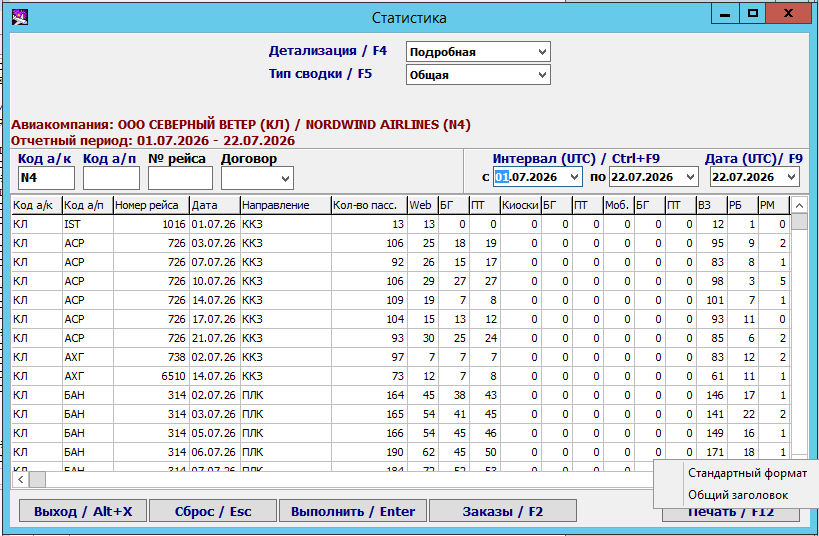

#### Шаг 2
В поле «Детализация» выберите тип отчета **«Подробная»**. В поле «Код а/к» укажите `N4` (или `EO`), задайте период дат и нажмите кнопку **«Выполнить»**.
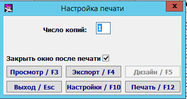

#### Шаг 3
В нижнем меню нажмите **«Печать»** и выберите пункт **«Стандартный формат»**.
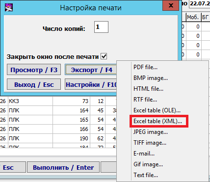

#### Шаг 4
В появившемся окне настроек печати нажмите кнопку **«Экспорт»** (вместо предварительного просмотра).
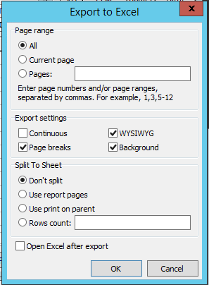

#### Шаг 5
В списке доступных форматов выберите пункт **`Excel table (XML)...`** и нажмите «ОК».
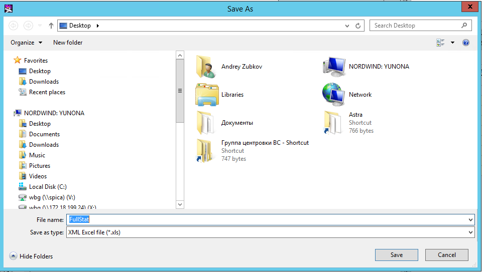

#### Шаг 6
Сохраните сформированный файл `.xls` на диск компьютера и перетащите его мышью в область **Drag & Drop** во вкладке «Администрирование» в программе AeroBag Predictor. База обновится за 1 секунду!
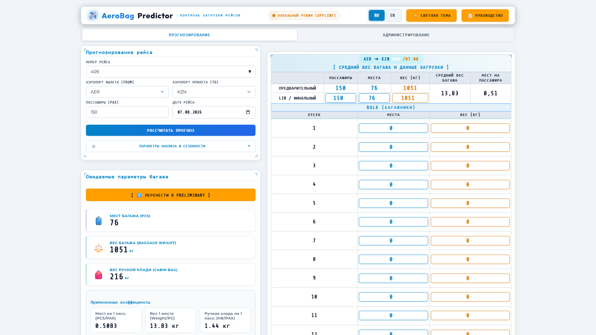

---

## 13. Модуль исторического бэктестинга (Проверка точности)

Кнопка **`[ 🔬 Тест точности (Backtest) ]`** открывает сертифицированный симулятор верификации:

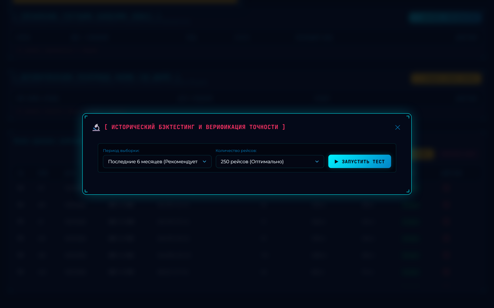

1. Выберите период выборки (3 месяца, 6 месяцев, 1 год, вся база) и количество рейсов для теста (от 50 до 1000).
2. Нажмите **`▶ Запустить тест`**.
3. Программа промоделирует реальные вылеты и покажет:
   - **Среднюю ошибку веса (MAE, кг)**;
   - **Среднюю ошибку мест (MAE, шт)**;
   - **Процент попадания в коридор $\pm 10\%$**;
   - **Прирост точности (Accuracy Gain %)** нового алгоритма относительно классического метода.

---

**AeroBag Predictor v12.0** — надежный инструмент коммерческой загрузки и безопасности полетов.
